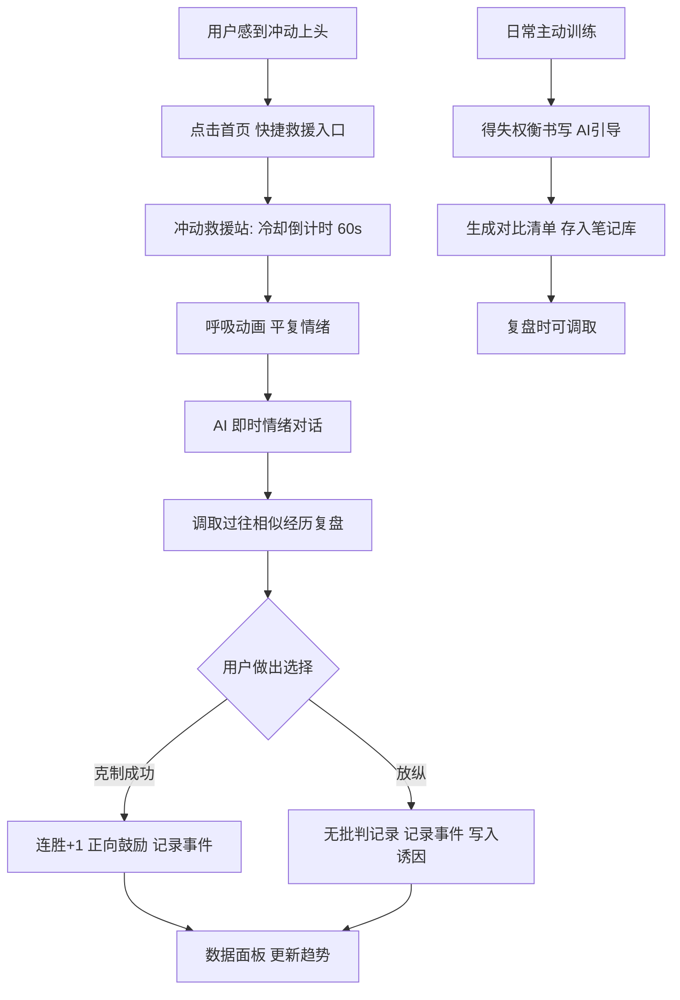

# 《觉醒》自控力训练 APP - 产品需求文档（PRD）

## 1. 产品概述
- 《觉醒》是一款面向深夜高压、焦虑易冲动人群的 AI 自控力训练工具。通过得失权衡书写、即时情绪疏导、过往经历复盘三大核心 AI 交互，帮助用户从本能冲动中抽离，唤醒理智主导行为，循序渐进提升自控力。
- 产品价值：以"有得必有失"的权衡逻辑 + 数据正向反馈，替代道德批判与意志力对抗，把自控训练变成可量化、可回顾、可成长的长期习惯。

## 2. 核心功能

### 2.2 功能模块
1. **今日觉醒首页**：当日状态总览、克制连胜、快捷冲动救援入口、每日一句温和提醒
2. **得失权衡书写**：AI 引导用户填写长期目标、必备条件、需舍弃的短期享乐，生成对比清单
3. **即时情绪对话**：欲望上头时与内置 AI 对话，温和正向疏导，拉回理智
4. **过往经历复盘**：调取历史克制记录，AI 结合相似场景做复盘提醒
5. **冲动救援站**：一键进入冷却倒计时 + AI 对话 + 历史复盘的快速通道
6. **数据成长面板**：多维度可视化图表，展示克制成功率、情绪诱因分布、成长趋势
7. **健康替代方案**：散步、呼吸冥想、拉伸、情绪记录等替代放松引导
8. **隐私设置**：本地加密存储开关、数据导出、重置

### 2.3 页面详情
| 页面名称 | 模块名称 | 功能描述 |
|---------|---------|---------|
| 今日觉醒首页 | 状态总览 | 当日克制次数、连胜天数、本周成功率环形进度 |
| 今日觉醒首页 | 快捷救援入口 | 大尺寸"我快失控了"按钮，一键跳转冲动救援站 |
| 今日觉醒首页 | 每日提醒 | 温和治愈文案轮播，无批判引导 |
| 今日觉醒首页 | 最近权衡卡片 | 展示最近一条得失权衡笔记，点击查看详情 |
| 得失权衡书写 | 目标引导 | AI 分步引导输入长期目标、必备条件、需舍弃享乐 |
| 得失权衡书写 | 对比清单生成 | 自动生成"短暂快感 vs 长期收益"双栏对比卡片 |
| 得失权衡书写 | 历史权衡列表 | 按时间倒序展示所有权衡笔记，支持查看与删除 |
| 即时情绪对话 | 对话窗口 | 流式打字效果 AI 回复，温和包容话术 |
| 即时情绪对话 | 快捷情绪标签 | 焦虑/孤独/疲惫/无聊等情绪快捷选择，辅助 AI 上下文 |
| 过往经历复盘 | 复盘卡片流 | 展示历史相似冲动场景、当时心理状态、克制后正向感受 |
| 过往经历复盘 | AI 复盘总结 | 结合用户记录生成"你曾经做到过"的鼓励总结 |
| 冲动救援站 | 冷却倒计时 | 圆形倒计时（60s 可调），柔和呼吸动画 |
| 冲动救援站 | 三步引导 | 倒计时 → AI 对话 → 历史复盘，分步卡片切换 |
| 冲动救援站 | 结果记录 | 强制记录本次结局（克制成功/放纵），写入数据 |
| 数据成长面板 | 总览卡片 | 总克制次数、总放纵次数、克制成功率 |
| 数据成长面板 | 趋势折线图 | 近 30 天克制次数趋势 |
| 数据成长面板 | 诱因分布 | 情绪诱因饼图，识别主要触发源 |
| 数据成长面板 | 交易记录流 | 按时间倒序的完整事件流（克制/放纵/权衡/对话） |
| 健康替代方案 | 方案卡片 | 散步/呼吸/拉伸/冥想/情绪记录，点击进入对应引导 |
| 健康替代方案 | 呼吸引导 | 4-7-8 呼吸法动画引导 |
| 隐私设置 | 加密开关 | 本地存储加密开关与状态展示 |
| 隐私设置 | 数据导出 | 导出 JSON 备份 |
| 隐私设置 | 重置数据 | 二次确认后清空全部本地数据 |

## 3. 核心流程

**主流程 - 冲动来袭时**：用户感到欲望上头 → 点击首页"我快失控了" → 进入冲动救援站 → 冷却倒计时 60s（呼吸动画）→ 倒计时结束进入 AI 对话疏导 → 引导查看历史相似复盘 → 用户做出选择（克制/放纵）→ 记录本次事件到数据面板 → 若克制则连胜+1并正向鼓励。

**辅助流程 - 日常训练**：用户主动进入得失权衡书写 → AI 分步引导填写目标与舍弃项 → 生成对比清单 → 存入权衡笔记库 → 可在复盘时调取。

## 4. 用户界面设计

### 4.1 设计风格
- **主色调**：暖米白底（#F7F3EC）+ 晨曦桃（#E8B4A0）+ 静谧鼠尾草绿（#8FA89B）+ 暮色紫灰（#9B8FA8）作为点缀
- **辅助色**：柔金（#D4B896）用于强调与成就，深炭灰（#3A3633）用于正文
- **按钮风格**：大圆角（24px+）、柔和阴影、轻按压反馈，禁用尖锐直角
- **字体**：标题使用 "Noto Serif SC"（思源宋体）传递治愈感与份量感；正文使用 "Noto Sans SC"（思源黑体）保证可读性
- **布局风格**：卡片式、大量留白、垂直呼吸感、左右不对称的杂志式排版
- **图标/emoji**：使用细线条 SVG 图标，禁用写实 emoji，保持克制
- **动效**：呼吸式渐变、柔和淡入、弹性回弹，避免突兀闪烁；粒子级光斑背景营造静谧氛围

### 4.2 页面设计概览
| 页面名称 | 模块名称 | UI 元素 |
|---------|---------|---------|
| 今日觉醒首页 | 状态总览 | 顶部问候 + 大号连胜数字 + 环形进度环 |
| 今日觉醒首页 | 快捷救援 | 居中超大圆形按钮，呼吸光晕动画 |
| 得失权衡书写 | 对比清单 | 左右双栏卡片，左暖右冷色调对比 |
| 即时情绪对话 | 对话窗口 | 圆角气泡，AI 头像柔和光圈，流式打字 |
| 冲动救援站 | 倒计时 | 全屏圆形进度，4-7-8 呼吸引导文字 |
| 数据成长面板 | 图表区 | 折线/环形/饼图，柔和配色，hover 高亮 |
| 健康替代方案 | 方案卡 | 网格卡片，每张配呼吸引导动画 |

### 4.3 响应式
桌面优先（最大宽度 1200px 居中），移动端自适应单列布局，触控按钮最小 44px，支持触摸滑动切换救援站步骤。

### 4.4 3D 场景指引
不使用 3D 场景，采用 2D 柔和渐变 + SVG 粒子营造氛围。
