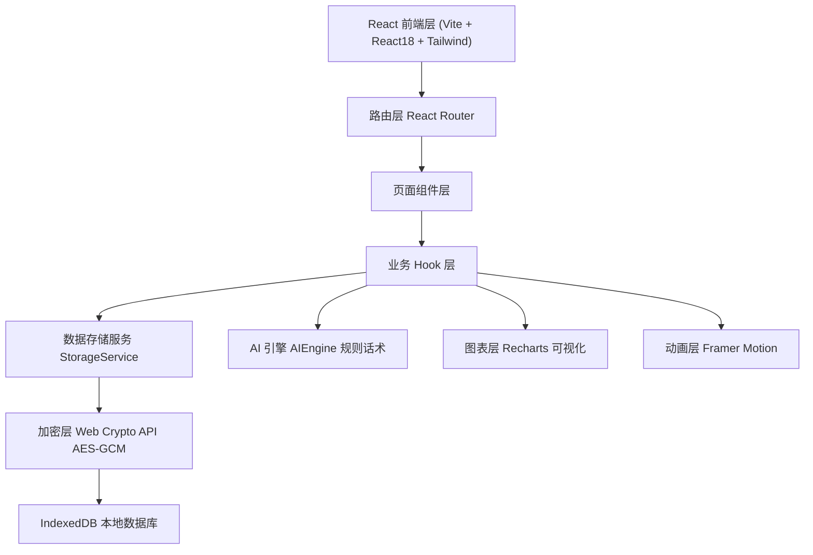

# 《觉醒》自控力训练 APP - 技术架构文档

## 1. 架构设计

纯前端单页应用，无后端服务。所有用户数据本地加密存储于浏览器 IndexedDB，通过 Web Crypto API 完成对称加密。AI 对话采用本地规则引擎模拟（基于话术模板 + 上下文匹配），保证离线可用与隐私安全。



## 2. 技术说明
- 前端：React@18 + tailwindcss@3 + vite@5
- 初始化工具：vite-init（react-ts 模板）
- 路由：react-router-dom@6
- 动画：framer-motion@11
- 图表：recharts@2
- 加密：Web Crypto API（AES-GCM）+ IndexedDB（idb-keyval 封装）
- 后端：无（纯本地应用）
- 数据库：浏览器 IndexedDB（本地隐私存储）

## 3. 路由定义
| 路由 | 用途 |
|------|------|
| `/` | 今日觉醒首页（状态总览 + 快捷救援入口） |
| `/tradeoff` | 得失权衡书写（AI 引导 + 对比清单 + 历史列表） |
| `/chat` | 即时情绪对话（AI 疏导窗口） |
| `/review` | 过往经历复盘（历史卡片流 + AI 复盘总结） |
| `/rescue` | 冲动救援站（倒计时 → 对话 → 复盘三步引导） |
| `/stats` | 数据成长面板（图表 + 事件流） |
| `/alternatives` | 健康替代方案（呼吸引导 + 方案卡） |
| `/settings` | 隐私设置（加密开关 + 导出 + 重置） |

## 4. API 定义
无后端 API。所有数据访问通过本地 `StorageService` 单例提供：
```ts
interface StorageService {
  getEvents(): Promise<EventRecord[]>
  addEvent(event: EventRecord): Promise<void>
  getTradeoffs(): Promise<TradeoffNote[]>
  addTradeoff(note: TradeoffNote): Promise<void>
  getDialogs(): Promise<DialogSession[]>
  addDialog(session: DialogSession): Promise<void>
  getStats(): Promise<StatsSnapshot>
  exportData(): Promise<string>
  resetData(): Promise<void>
}
```

## 5. 服务器架构
无服务器，纯客户端架构。

## 6. 数据模型

### 6.1 数据模型定义
```mermaid
erDiagram
    EventRecord ||--o{ Trigger } : "has"
    TradeoffNote ||--o{ EventRecord } : "referenced-by"
    DialogSession ||--o{ DialogMessage } : "contains"
    UserProgress ||--|| EventRecord : "aggregates"

    EventRecord {
      string id PK
      number timestamp
      string type "restrain|relapse"
      string trigger "anxiety|loneliness|fatigue|boredom|stress|other"
      string scenario "text"
      string outcomeNote "text"
      string relatedTradeoffId FK
    }
    TradeoffNote {
      string id PK
      number timestamp
      string longGoal "long-term goal"
      string[] requirements "必备条件"
      string[] sacrifices "需舍弃短期享乐"
      string shortGain "短期快感描述"
      string longReward "长期收益描述"
    }
    DialogSession {
      string id PK
      number timestamp
      string trigger "情绪诱因"
      DialogMessage[] messages
    }
    DialogMessage {
      string role "user|ai"
      string content
      number timestamp
    }
    UserProgress {
      number totalRestrain
      number totalRelapse
      number currentStreak
      number bestStreak
      number lastRestrainDate
    }
```

### 6.2 数据定义语言（IndexedDB Schema）
使用 `idb-keyval` 封装，store 结构：
- `events`：EventRecord 列表，key 为 id
- `tradeoffs`：TradeoffNote 列表
- `dialogs`：DialogSession 列表
- `progress`：单一 UserProgress 对象
- `meta`：加密密钥盐、加密开关状态

加密策略：用户开启加密后，所有写入值经 AES-GCM 加密为密文 ArrayBuffer 存储；读取时解密。密钥派生自用户 PIN + 随机盐（PBKDF2），盐存于 meta store。未开启加密时明文存储。
